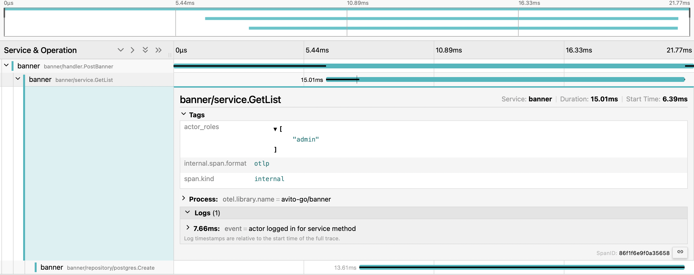

# Banner service
## Киселев Иван Александрович 
### kiselev.contact@gmail.com

### Описание сборки:
[BUILD_README.md](services/banner/docs/BUILD_README.md)
### Описание конфигураций

[CONFIG.md](services/banner/docs/CONFIG_README.md)
## Краткое описание написанного мной сервиса
- Написан in-memory кеш, который обновляется фоновой процедурой (с чуткой настройкой и поддержкой graceful отключения).
- Подключены метрики для мониторинга во время нагрузочного тестирования.

## Общее описание написанного мной сервиса
В проекте сервиса
- Чистая архитектура и
  проработанный по best practice project layout
- Написанная мной библиотека xapp для работы с ошибками в REST сервисе, облегчающая вывод ошибок, но скрывающая чувствительные данные от end user
- Интеграция легковесного демона (daemon) — CacheRefresher и PostponeDeleter (обновление кеша и отложенное удаление
- Трассировка c использованием Open telemetry и jaeger
- Метрики с Prometheus и Grafana показывающие нагрузку на память и процессоры сервиса
- Docker multistage build методы сборки программы
- Docker compose файлы с для наблюдаемости и сервисов отдельно.
- Настройка конфигов с .env, который переписывает yaml.
- OpenAPI спецификация сервиса, генерация сервера по ней.

На каждый слой были сделаны модели и конвертеры.

Также были использованы другие мои библиотеки
- xshutdown: graceful shutdown библиотека включающая в себя безопасное создание callback’а из любой точки приложение, детальную настройку тайм-аутов, возможность обработки ошибок и force shutdown
-  xconfig: инструмент переписывающий yaml конфиги переменными из env, используя рефлексию

## Демонстрация работы элементов сервиса

### Grafana и Метрики из Prometheus:
Тут можно видеть нагрузку на процессоры и память сервиса.
Очень важные метрики для контроля нагрузки на сервис и его будущей оптимизации.
Выделение и очистка памяти в Go важный критерий для хорошей работы сервиса при высоких RPS.

### Трассировки с Jaeger и Open telemetry:
Тут можно видеть контекст запросов. Это нужно для контроля и исправления ошибок в работе одного и множества микросервисов.
Тут можно видеть как работают спаны трассировки. Для каждого такого спана мы можем посмотреть в какой момент времени был вызван метод и сколько времени он занял.

### Deployments контейнеры:
Все контейнеры с мониторингом поднимаются и работают независимо от других сервисов.

### Postman с примерами тут:
[banner-api.postman_collection.json](services/banner/docs/banner-api.postman_collection.json)

